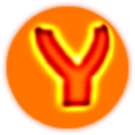

# Welcome to the Yet Another Wavelet toolbox.



## Introduction

This archive contains the code of the YAWtb toolbox. This toolbox was under active development till about 2010 nut *it is no longer developed*. The onlly purpose of this GitHub repository is to keep an accessible archive of this former toolbox, for instance, for possible analysis, fork, or porting into another numerical programming language (such as Python or Julia).

The purpose of this toolbox is to implement in Matlab:
- 1D, 2D, 3D Continuous Wavelet Transforms (CWTs)
- 1D+Time (spatio-temporal) CWT
- (Stereographical) Spherical CWT
- 2D dyadic Frames (isotropic and directional)
- (in development) Spherical Frames of Stereographical Wavelets


## Documentation

- Some [slides](doc/slides/yawtb.pdf) describing the toolbox and its philosophy (2003)
- [Yet Another Wavelet Toolbox Reference Guide](doc/tex/YAWTBReferenceManual.pdf) (2003, pdf)
(remark: LaTeX sources are available in the repository) 

## Wanna help?

This toolbox should ideally be ported to Python, which is more flexible than matlab and interface more naturally with the C files required for instance by the spherical wavelet transform. However, none of the authors have time anymore to make this transfer. If you want to help, feel free to contact [Laurent Jacques](https://perso.uclouvain.be/laurent.jacques/) for more information.  

## License

This toolbox and all its files are provided under the "GNU GENERAL PUBLIC LICENSE, Version 2, June 1991".
See this [file](COPYING.txt) for more information.

## Warnings

This is the version 0.1.0 of the YAWtb, the initial release.
It is still an unstable version and a lot of work has to be done 
especially on the documentation (use YAWtb at your own, rather limited, risk).
Any comments are welcome on our mailing lists (see the YAWtb website)

### Requirements

The YAWtb works for Matlab versions greater than 5 and was developped onto the 6th.
If you have some bugs, all emails are welcome at <yawtb-devel@lists.sourceforge.net>.
See the YAWtb homepage (http://www.fyma.ucl.ac.be/projects/yawtb) if you desire more 
information about this mailing list.

### Installation

In the sequel, the `>>` symbols represents the Matlab prompt.

Follow these steps to install the YAWtb Matlab toolbox,

1. Unpack YAWtb where you want (say the `<YAWTBDIR>` directory for simplicity);

2. Compile all the YAWtb mexfiles (provided that your `mex` matlab script is well configured) with the  `yamake` utility:
```
>> cd <YAWTBDIR>
>> yamake
```
(and for a more explicit compilation `>> yamake debug`)

**Remark**: If you have Microsoft Windows (9x, 2000, XP, ...), it seems that the native Matlab compiler, and also this of Windows, are not
able to compile correctly the yawtb C code (e.g. cwtsph stuff). Use instead the free compiler of Borland available at http://www.borland.com (need a simple registration) and configure Matlab in function (run 'mex -setup' and read the Borland compiler FAQ and doc).

3. Run `yaload` in Matlab to load the whole YAWtb path:
```
>> cd <YAWTBDIR>
>> yaload
```

4. Add the following lines to a matlab startup file, either the general one (matlabrc.m) located in MATLABDIR/toolbox/local, or the local startup file (startup.m) somewhere in your home dir (see matlab doc):
```
%% YAWtb installation
olddir=pwd;
cd <YAWTBDIR>
yaload;
cd(olddir);
clear olddir;
```

5. Enjoy of YAWtb !

## TODO List

Here is the TODO list of things to improve, create, delete inside the YAWtb project:

- Using signal instead of their Fourier transform in various mfiles
(`cwt<n>d`, `cwtsph`, ...) and allowing the use of the fft with a special keyword 
(e.g. `fft`);

- Setting sampling period in `cwt1d.m`

- improve the documentation of `morletsph.m` and `dogsph.c` is really
  poor.

- check the documentation of `cwt1dt.m` and the associated spatio
  temporal Morlet wavelet.

- use `k_0` (or `a_0`) and `c_0` to control the 1dt Morlet wavelet instead
of `k_0` and `w_0`.

- `yademo` fails with `cwt1dt` or `movgauss`: Comments are
  inserted directly in the code environment.  Note that in `cwt1d`
  comments were outside of this environment.  We probably need to
  move them outside of this environment.

- The norm $L^1$ or $L^2$ is not taken into account in cwt1dt.
 ```
>> mat = movgauss;
>> wave = cwt1dt(fft2(mat),'mexican',[4 5 6],[1],'order',4,'sigma',1,'sigmax',1,'sigmat',8);
>> yashow(wave,'filter');
```
The plot is not correct because we expect an anisotropic wavelet.

- The filter option does not exist with `cwt1d`.


## Toolbox directory tree
```
Here is the current explanation of the yawtb tree

===
yawtb (=>:directories, ->:files)
|
|-> AUTHORS               /* GPL file */
|-> COPYING               /* GPL file */
|-> yaload.m              /* yawtb startup file (addpath, etc ...) */
|-> yamake.m              /* compilations of the yawtb mexfiles */
|
|=> doc                   /* Documentation */
|   |=> html
|   |=> ps
|   |=> ascii
|   `=> tex
|
|=> continuous            /* All the continuous transfrom */
|   |=> 1d                /* 1D CWT */ 
|   |=> 2d                /* 2D CWT */
|   |=> 1dt               /* 1D+T CWT (spatio-temporal) */ 
|   `=> sphere            /* Spherical CWT */
|
|=> discrete
|   |=> packet            /* Wavelet Packets in 1d and 2d */
|   |   |=> 1d   	
|   |   `=> 2d 	          
|   |=> matchp            /* matching pursuit  */
|   |=> laplacian
|   `=> ortho             /* orthogonal wavelet */              
|
|=> frames                /* Wavelet Frames */
|   |=> 1d   	
|   |=> 2d 	          
|   `=> sphere
|
|=> include               /* Directories for storing general usage
|                            C-File that may be useful for many
|=> interfaces            /* Various interfaces to external (GPL) program
|   `=> spharmonickit     /* Interface to the SpharmonicKit */
|
|=> lib                   /* MEX-File */
|
|=> src
|   
|=> tools
|   |=> display           /* universal display function (yashow.m) */
|   |=> misc              /* various utils (vect, noising, thresholding, ...) */
|   |=> cmap              /* various colormap needed by som yawtb functions (e.g. rgray, ...) */
|   |=> devel             /* The developper corner (see README inside) */
|   `=> io                /* Input/Output scripts (like pgm read & write) */
|
|=> demos                 /* some demo of yawtb */
|   `=> denoising
|	|=> 1d	          /* Various techniques related to signal denoising */  
|	|=> 2d            /* Various techniques related to image denoising */
|	`=> sphere        /* Various techniques related to spherical denoising */
|
`=> samples               /* samples for the different WT */            	
    |=> 1d         
    |=> 2d
    |=> 1dt 
    `=> sphere  
```


## Authors (alphabetical authors)
- Alain Coron 
- Laurent Demanet
- [Laurent Jacques](https://perso.uclouvain.be/laurent.jacques/) (corresponding author) 
- Attilio Rivoldini 
- Pierre Vandergheynst

## Acknowledgements

The YAWtb team want to thank you the following persons 
for their kind contributions to the toolbox :
- Boris Cigale
- Geoffroy Piroux
- ...
